<h2 style="text-align: center;">Dialectal Gap Across Language Clusters</h2>

Here we plot the zero-shot dialectal gap across all tasks. On the x-axis, we plot aggregated cluster-level gap compared to English, while on the y-axis, we plot the aggregated cluster-level gap compared to the representative variety (standard variety). In an ideal scenario, both of these gap values would be close to zero. 

    <figure style="display: inline-block; text-align: center; margin-right: 20px;">
        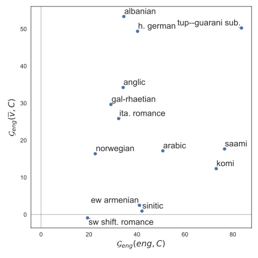
        <figcaption style="width: 100%;">Dependency Parsing</figcaption>
    </figure>
    <figure style="display: inline-block; text-align: center; margin-right: 20px;">
        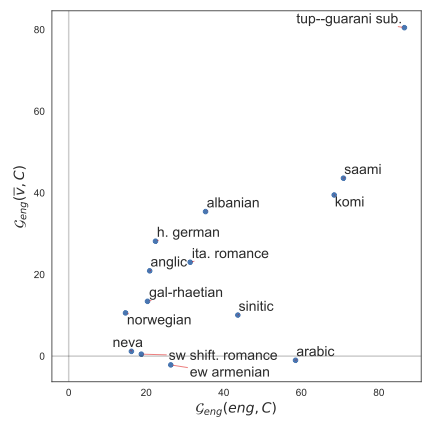
        <figcaption style="width: 100%;">POS Tagging</figcaption>
    </figure>
    <figure style="display: inline-block; text-align: center;">
        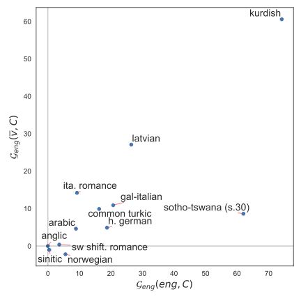
        <figcaption style="width: 100%;">Topic Classification</figcaption>
    </figure>

As expected, we oberve that low-resource clusters have genrally have higher dialectal gaps when compared to English and even when compared to the standard variety within the cluster. High-resource Germanic and Sinitic language clusters consistently exhibit low dialectal gaps. 

    <figure style="display: inline-block; text-align: center; margin-right: 20px;">
        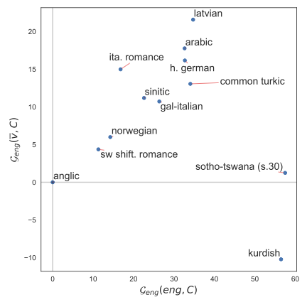
        <figcaption style="width: 100%;">Natural Language Inference</figcaption>
    </figure>
    <figure style="display: inline-block; text-align: center; margin-right: 20px;">
        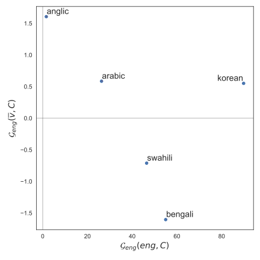
        <figcaption style="width: 100%;">Extractive Question Answering</figcaption>
    </figure>
    <figure style="display: inline-block; text-align: center;">
        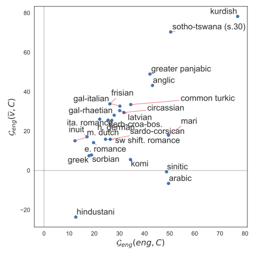
        <figcaption style="width: 100%;">Named Entity Recognition</figcaption>
    </figure>

<h2 style="text-align: center;">Task Specific Scores</h2>

<h3 style="text-align: center;">Structured Prediction</h3>

Across all structured prediction tasks, we observe higher performance in higher-resourced Indo-European languages compared to low-resource varieties from  indigenous South American and  Uralic language clusters. 

<figure style="display: block; margin: 0 auto; text-align: center;">
    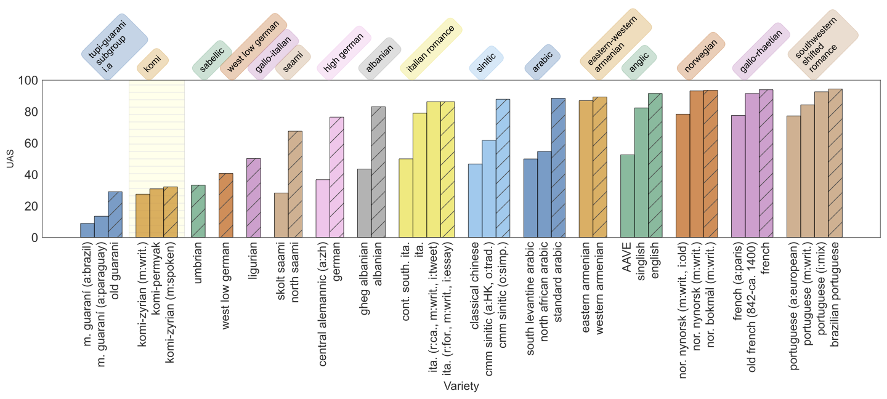
    <figcaption style="width: 100%;">Dependency Parsing</figcaption>
</figure>

<figure style="display: block; margin: 0 auto; text-align: center;">
    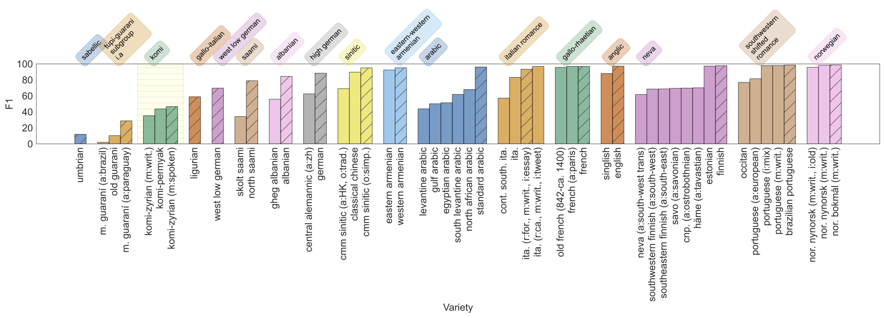
    <figcaption style="width: 100%;">POS Tagging</figcaption>
</figure>

<figure style="display: block; margin: 40px auto; text-align: center;">
    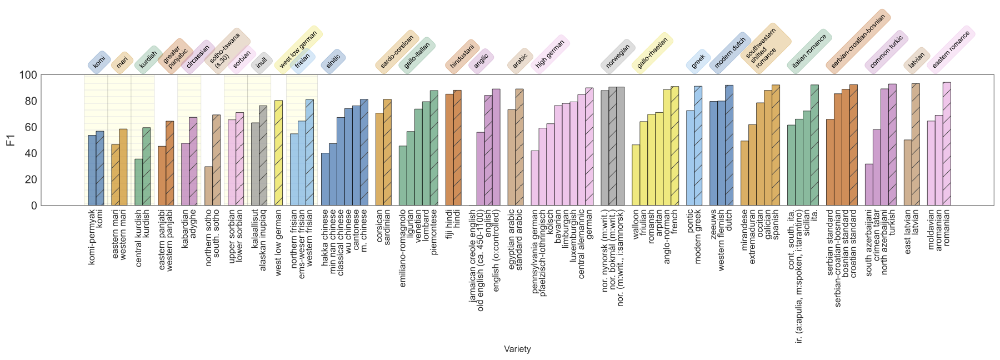
    <figcaption style="width: 100%;">Named Entity Recognition</figcaption>
</figure>

<h3 style="text-align: center;">Sequence Classification</h3>

Here,  we report city-level Dialect Identification results for Arabic and High German but country-level results for Portuguese, Spanish and English. For Sentiment Analysis, we only report region/country-level results for Arabic. We generally observe the largest in-cluster disparity within Kurdish. The Sotho varieties consistently perform significantly lower compared to other varities on NLI and DiD. Overall we find the Chinese \cluster{} performing on par with high-resource Latin counterparts.

<figure style="display: block; margin: 0 auto; text-align: center;">
    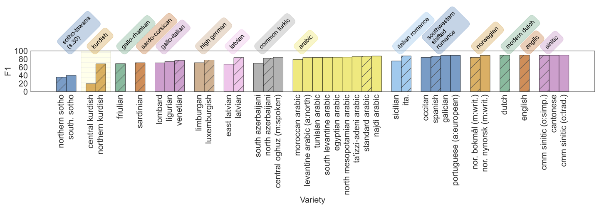
    <figcaption style="width: 100%;">Topic Classification</figcaption>
</figure>

<figure style="display: block; margin: 0 auto; text-align: center;">
    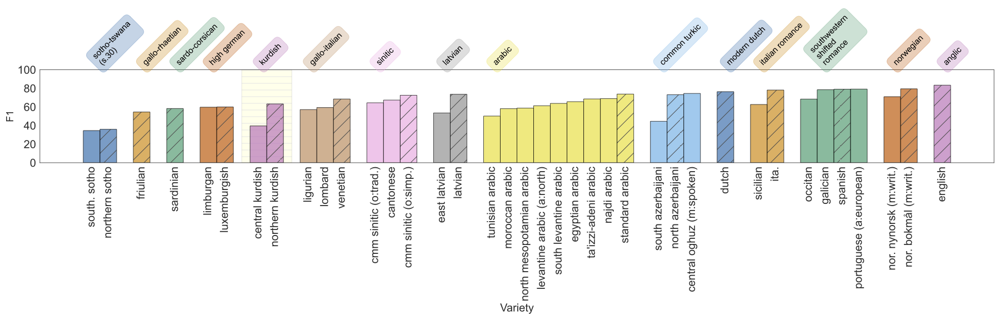
    <figcaption style="width: 100%;">Natural Language Inference</figcaption>
</figure>

<figure style="display: block; margin: 0 auto; text-align: center;">
    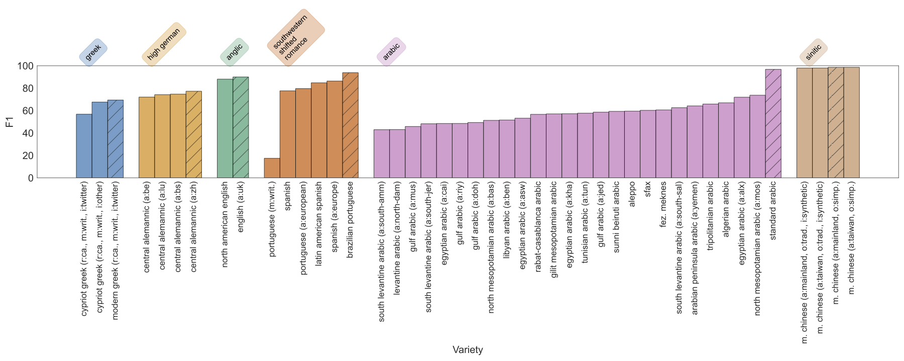
    <figcaption style="width: 100%;">Dialect Identification</figcaption>
</figure>

<figure style="display: block; margin: 40px auto; text-align: center;">
    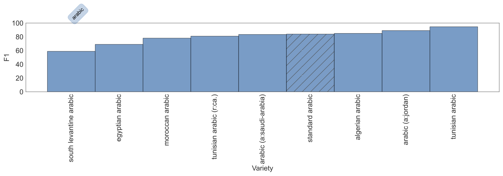
    <figcaption style="width: 100%;">Sentiment Analysis</figcaption>
</figure>

<h3 style="text-align: center;">Question Answering</h3>

There are no significant gaps within varities in each cluster, In EQA zero-shot experiments, English and its varieties have the highest performance overall and Korean varieties score the lowest. 

<figure style="display: block; margin: 0 auto; text-align: center;">
    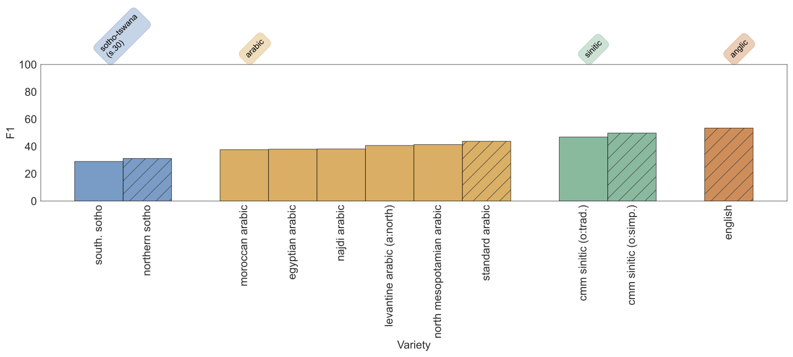
    <figcaption style="width: 100%;">Multiple Choice Machine Reading Comprehension</figcaption>
</figure>

<figure style="display: block; margin: 40px auto; text-align: center;">
    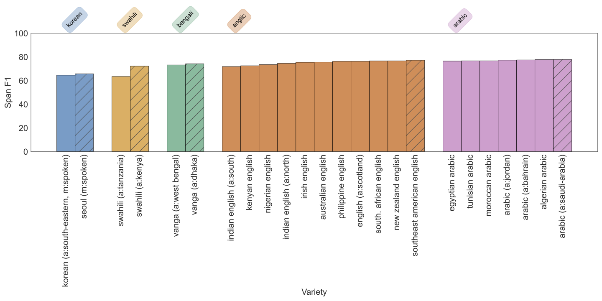
    <figcaption style="width: 100%;">Extractive Question Answering</figcaption>
</figure>

<h3 style="text-align: center;">Machine Translation</h3>

Here, the performance gap varies widely across and within language varieties. The model perfomance is similar within the Swiss-German. We see surprisingly higher scores on the eastern Norwegian dialect even though we perform zero-shot transfer from Norwegian Nynorsk (a Western dialect) . Refer to the plots for detailed results on other language clusters. 

<figure style="display: block; margin: 0 auto; text-align: center;">
    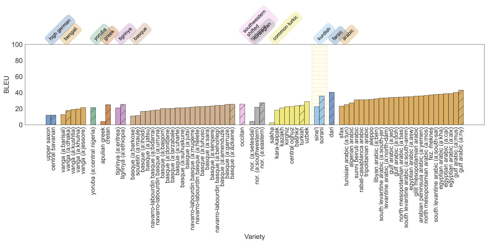
    <figcaption style="width: 100%;">Variety level aggregation</figcaption>
</figure>

<figure style="display: block; margin: 0 auto; text-align: center;">
    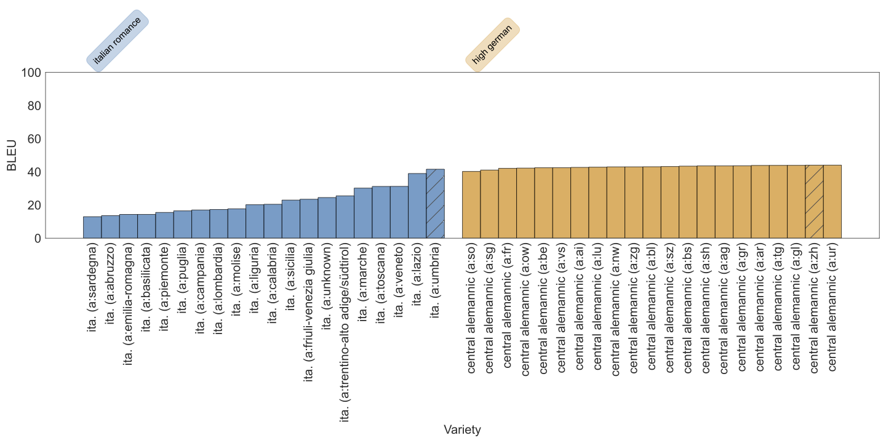
    <figcaption style="width: 100%;">Region level aggregation for Swiss German and Italian</figcaption>
</figure>

<h2 style="text-align: center;">Regional Maps</h2>
