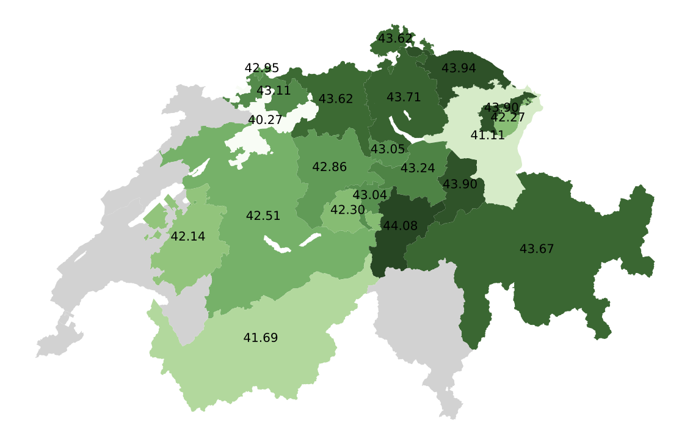
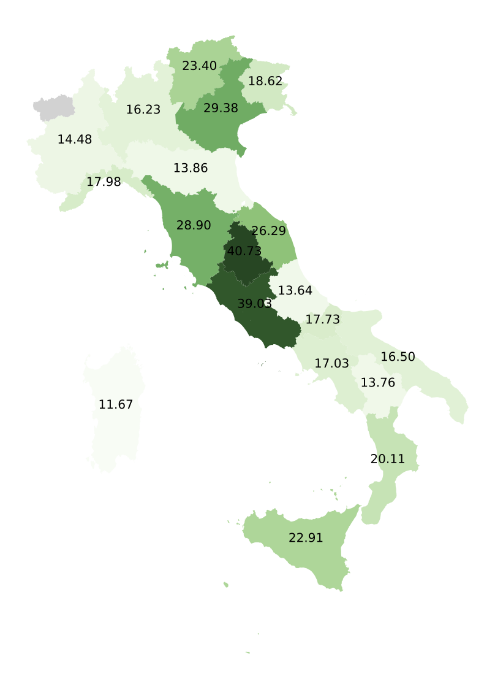

<h2 style="text-align: center;">Dialectal Gap Across Language Clusters</h2>

Here we plot the zero-shot dialectal gap across all tasks. On the x-axis, we plot aggregated cluster-level gap compared to English, while on the y-axis, we plot the aggregated cluster-level gap compared to the representative variety (standard variety). In an ideal scenario, both of these gap values would be close to zero. 

    <figure style="display: inline-block; text-align: center; margin-right: 20px;">
        
        <figcaption style="width: 100%;">Dependency Parsing</figcaption>
    </figure>
    <figure style="display: inline-block; text-align: center; margin-right: 20px;">
        
        <figcaption style="width: 100%;">POS Tagging</figcaption>
    </figure>
    <figure style="display: inline-block; text-align: center;">
        
        <figcaption style="width: 100%;">Topic Classification</figcaption>
    </figure>

As expected, we oberve that low-resource clusters have genrally have higher dialectal gaps when compared to English and even when compared to the standard variety within the cluster. High-resource Germanic and Sinitic language clusters consistently exhibit low dialectal gaps. 

    <figure style="display: inline-block; text-align: center; margin-right: 20px;">
        
        <figcaption style="width: 100%;">Natural Language Inference</figcaption>
    </figure>
    <figure style="display: inline-block; text-align: center; margin-right: 20px;">
        
        <figcaption style="width: 100%;">Extractive Question Answering</figcaption>
    </figure>
    <figure style="display: inline-block; text-align: center;">
        
        <figcaption style="width: 100%;">Named Entity Recognition</figcaption>
    </figure>

<h2 style="text-align: center;">Task Specific Scores</h2>

<h3 style="text-align: center;">Structured Prediction</h3>

Across all structured prediction tasks, we observe higher performance in higher-resourced Indo-European languages compared to low-resource varieties from  indigenous South American and  Uralic language clusters. 

<figure style="display: block; margin: 0 auto; text-align: center;">
    
    <figcaption style="width: 100%;">Dependency Parsing</figcaption>
</figure>

<figure style="display: block; margin: 0 auto; text-align: center;">
    
    <figcaption style="width: 100%;">POS Tagging</figcaption>
</figure>

<figure style="display: block; margin: 40px auto; text-align: center;">
    
    <figcaption style="width: 100%;">Named Entity Recognition</figcaption>
</figure>

<h3 style="text-align: center;">Sequence Classification</h3>

Here,  we report city-level Dialect Identification results for Arabic and High German but country-level results for Portuguese, Spanish and English. For Sentiment Analysis, we only report region/country-level results for Arabic. We generally observe the largest in-cluster disparity within Kurdish. The Sotho varieties consistently perform significantly lower compared to other varities on NLI and DiD. Overall we find the Chinese \cluster{} performing on par with high-resource Latin counterparts.

<figure style="display: block; margin: 0 auto; text-align: center;">
    
    <figcaption style="width: 100%;">Topic Classification</figcaption>
</figure>

<figure style="display: block; margin: 0 auto; text-align: center;">
    
    <figcaption style="width: 100%;">Natural Language Inference</figcaption>
</figure>

<figure style="display: block; margin: 0 auto; text-align: center;">
    
    <figcaption style="width: 100%;">Dialect Identification</figcaption>
</figure>

<figure style="display: block; margin: 40px auto; text-align: center;">
    
    <figcaption style="width: 100%;">Sentiment Analysis</figcaption>
</figure>

<h3 style="text-align: center;">Question Answering</h3>

There are no significant gaps within varities in each cluster, In EQA zero-shot experiments, English and its varieties have the highest performance overall and Korean varieties score the lowest. 

<figure style="display: block; margin: 0 auto; text-align: center;">
    
    <figcaption style="width: 100%;">Multiple Choice Machine Reading Comprehension</figcaption>
</figure>

<figure style="display: block; margin: 40px auto; text-align: center;">
    
    <figcaption style="width: 100%;">Extractive Question Answering</figcaption>
</figure>

<h3 style="text-align: center;">Machine Translation</h3>

Here, the performance gap varies widely across and within language varieties. The model perfomance is similar within the Swiss-German. We see surprisingly higher scores on the eastern Norwegian dialect even though we perform zero-shot transfer from Norwegian Nynorsk (a Western dialect) . Refer to the plots for detailed results on other language clusters. 

<figure style="display: block; margin: 0 auto; text-align: center;">
    
    <figcaption style="width: 100%;">Variety level aggregation</figcaption>
</figure>

<figure style="display: block; margin: 0 auto; text-align: center;">
    
    <figcaption style="width: 100%;">Region level aggregation for Swiss German and Italian</figcaption>
</figure>

<h2 style="text-align: center;">Regional MT Maps (Italian and Swiss German)</h2>

For Italian and Swiss-German we report Machine Translation results aggregated across regions in Italy and Switzerland respectively. (A darker
shade of green indicates a higher score). 

    <figure style="display: inline-block; text-align: center; margin-right: 20px;">
        
        <figcaption style="width: 100%;">Swiss German: Performance is similar within the Swiss-German cluster, with higher performance across regions in Northern Switzerland, which is geographically closer to Germany.</figcaption>
    </figure>
    <figure style="display: inline-block; text-align: center; margin-right: 20px;">
        
        <figcaption style="width: 100%;">Italian: For Italian, we see that areas adjacent to Tuscany exhibit darker shades of green, denoting higher performance. However, scores gradually diminish with distance from these regions.</figcaption>
    </figure>

<h2 style="text-align: center;">Highest and lowest scoring varieties</h2>

The highest-performing varieties are mostly standard high-resource languages and a few high-resource dialects (Norwegian dialects) whereas, the majority of the lowest-performing language variants are low-resourced varieties. This is not surprising, however we also note that there is a correlation between language writing script and its performance. The top-10 scroting varieties are  written with Latin script. 

| Task (Dataset)                          | Dialects with Highest Performance                                   | Dialects with Lowest Performance                                 |
|----------------------------------------|--------------------------------------------------------------------|------------------------------------------------------------------|
| DEP parsing (UD)                       | anglic/english* italian romance/italian (r:formal, m:written, i:essay)* | tupi-guarani subgroup i.a/old guarani* arabic/north african arabic |
|                                        | albanian/albanian* southwestern shifted romance/portuguese (a:european) | komi/komi-zyrian (m:written)* italian romance/continental southern italian |
|                                        | gallo-rhaetian/french* norwegian/norwegian nynorsk (m:written)*    | saami/skolt saami* komi/komi-zyrian (m:spoken)*                   |
|                                        | norwegian/norwegian bokmål (m:written)* southwestern shifted romance/portuguese (i:mix)* | tupi-guarani subgroup i.a/mbyá guaraní (a:paraguay) komi/komi-permyak |
|                                        | italian romance/italian* southwestern shifted romance/brazilian portuguese* | tupi-guarani subgroup i.a/mbyá guaraní (a:brazil)* saami/north saami* |
| EQA (SD-QA-test)                      | anglic/english (a:scotland) anglic/irish english                  | swahili/swahili (a:kenya)* arabic/algerian arabic                |
|                                        | anglic/southern african english anglic/philippine english         | bengali/vanga (a:west bengal)* arabic/tunisian arabic            |
|                                        | anglic/new zealand english anglic/nigerian english                | bengali/vanga (a:dhaka)* arabic/moroccan arabic                  |
|                                        | anglic/australian english anglic/indian english (a:north)         | korean/seoul (m:spoken)* arabic/egyptian arabic*                |
|                                        | anglic/southeast american english* anglic/kenyan english         | korean/korean (a:south-eastern, m:spoken)* swahili/swahili (a:tanzania)* |
| TC (SIB-200)                           | sinitic/classical-middle-modern sinitic (o:traditional)* italian romance/italian* | latvian/east latvian* arabic/moroccan arabic                    |
|                                        | anglic/english* southwestern shifted romance/galician*            | sotho-tswana (s.30)/northern sotho* high german/limburgan        |
|                                        | sinitic/cantonese* norwegian/norwegian nynorsk (m:written)*      | kurdish/northern kurdish gallo-italian/lombard                   |
|                                        | sinitic/classical-middle-modern sinitic (o:simplified)* norwegian/norwegian nynorsk (m:written)* | sotho-tswana (s.30)/southern sotho* gallo-italian/ligurian       |
|                                        | southwestern shifted romance/portuguese (a:european) arabic/standard arabic* | kurdish/central kurdish common turkic/south azerbaijani          |
| MRC (Belebele)                        | anglic/english* arabic/north mesopotamian arabic                  | arabic/moroccan arabic sinitic/classical-middle-modern sinitic (o:simplified)* |
|                                        | sinitic/classical-middle-modern sinitic (o:simplified)* arabic/moroccan arabic | arabic/egyptian arabic* sinitic/classical-middle-modern sinitic (o:traditional)* |
|                                        | sinitic/classical-middle-modern sinitic (o:traditional)* arabic/egyptian arabic* | arabic/najdi arabic sinitic/classical-middle-modern sinitic (o:traditional)* |
|                                        | arabic/standard arabic* arabic/najdi arabic                      | sotho-tswana (s.30)/northern sotho* arabic/levantine arabic (a:north)* |
|                                        | arabic/levantine arabic (a:north)* sotho-tswana (s.30)/northern sotho* | sotho-tswana (s.30)/southern sotho* arabic/north mesopotamian arabic |
| NER (Wikiann)                          | anglic/english (o:controlled)* modern dutch/dutch*               | sinitic/classical chinese mari/western mari                     |
|                                        | norwegian/norwegian nynorsk (m:written)* southwestern shifted romance/galician* | sinitic/hakka chinese* gallo-italian/emiliano-romagnolo          |
|                                        | norwegian/norwegian (m:written, i:samnorsk) italian romance/italian* | sotho-tswana (s.30)/northern sotho* greater panjabic/eastern panjabi* |
|                                        | norwegian/norwegian bokmål (m:written)* hindustani/fiji hindi*     | kurdish/
| NLI (XNLI-translate-test) | anglic/english*                                             | norwegian/norwegian bokmål (m:written)*                   |
|                           | southwestern shifted romance/spanish*                       | sinitic/classical-middle-modern sinitic (o:simplified)*  |
|                           | southwestern shifted romance/portuguese (a:european)        | southwestern shifted romance/occitan                      |
|                           | italian romance/italian*                                    | norwegian/norwegian nynorsk (m:written)*                  |
|                           | southwestern shifted romance/galician*                      | arabic/standard arabic*                                   |
| POS tagging (UD)          | anglic/english*                                             | gallo-rhaetian/french (a:paris)                          |
|                           | norwegian/norwegian bokmål (m:written)*                     | neva/finnish*                                             |
|                           | high german/german*                                         | italian romance/italian*                                  |
|                           | norwegian/norwegian nynorsk (m:written)*                    | neva/estonian*                                            |
|                           | gallo-rhaetian/french*